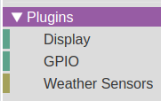
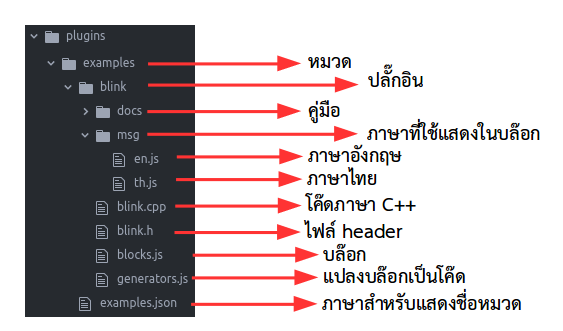
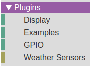
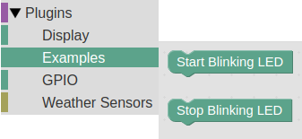
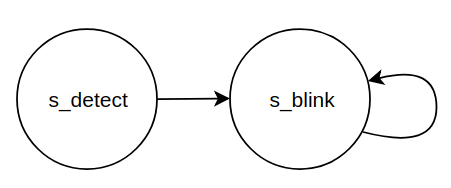
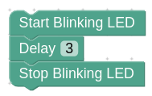
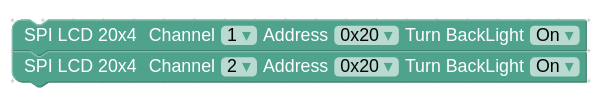

# blink plugin example

### แพลตฟอร์ม windows
- ติดตั้ง KidBright IDE (NEW UI, 64 bits)
- เปิดโปรแกรม KidBright IDE และ Minimize ไว้
- การพัฒนา plugins จะทดสอบผ่านโปรแกรม Google Chrome
- ใช้ Google Chrome พิมพ์ http://localhost:8000

### ตรวจสอบ plugins ที่ติดตั้งมากับโปรแกรม KidBright IDE


### โครงสร้างโฟลเดอร์สำหรับ blink plugin


### ตำแหน่งที่อยู่ของโฟลเดอร์ plugins
```
C:\Users\user\AppData\Local\KidBright\app-1.0.0\resources\app\kbide\plugins

*** หมายเหตุ: "C:\Users\user" เป็นโฟลเดอร์ของ windows user account ที่เข้าใช้งานอยู่ แต่ละเครื่องจะไม่เหมือนกัน
```

### สร้างหมวด examples
- สร้างโฟลเดอร์ examples

```
C:\Users\user\AppData\Local\KidBright\app-1.0.0\resources\app\kbide\plugins\examples
```

- สร้างไฟล์ examples.json

```
C:\Users\user\AppData\Local\KidBright\app-1.0.0\resources\app\kbide\plugins\examples\examples.json
```

- ใส่เนื้อหาในไฟล์ examples.json ดังนี้

```
{
	"name": {
		"en": "Examples",
		"th": "ตัวอย่าง"
	},
	"color": 160
}
```

### กด F5 ที่โปรแกรม Google Chrome เพื่อรีเฟรช plugins ที่เพิ่มเข้าใหม่


### สร้างโฟลเดอร์ blink

```
C:\Users\user\AppData\Local\KidBright\app-1.0.0\resources\app\kbide\plugins\examples\blink
```

### สร้างโฟลเดอร์เก็บไฟล์ภาษาสำหรับบล๊อก

```
C:\Users\user\AppData\Local\KidBright\app-1.0.0\resources\app\kbide\plugins\examples\blink\msg
```

### สร้างไฟล์ภาษา
- สร้างไฟล์ en.js สำหรับภาษาอังกฤษ

```
C:\Users\user\AppData\Local\KidBright\app-1.0.0\resources\app\kbide\plugins\examples\blink\msg\en.js
```

- ใส่เนื้อหาในไฟล์ en.js ดังนี้

```
Blockly.Msg.BLINK_START_TITLE = "Start Blinking LED";
Blockly.Msg.BLINK_START_TOOLTIP = "Start Blinking LED";
Blockly.Msg.BLINK_START_HELPURL = "";
Blockly.Msg.BLINK_STOP_TITLE = "Stop Blinking LED";
Blockly.Msg.BLINK_STOP_TOOLTIP = "Stop Blinking LED";
Blockly.Msg.BLINK_STOP_HELPURL = "";
```

- สร้างไฟล์ th.js สำหรับภาษาไทย

```
C:\Users\user\AppData\Local\KidBright\app-1.0.0\resources\app\kbide\plugins\examples\blink\msg\th.js
```

- ใส่เนื้อหาในไฟล์ th.js ดังนี้

```
Blockly.Msg.BLINK_START_TITLE = "เริ่มกระพริบแอลอีดี";
Blockly.Msg.BLINK_START_TOOLTIP = "เริ่มกระพริบแอลอีดี";
Blockly.Msg.BLINK_START_HELPURL = "";
Blockly.Msg.BLINK_STOP_TITLE = "หยุดกระพริบแอลอีดี";
Blockly.Msg.BLINK_STOP_TOOLTIP = "หยุดกระพริบแอลอีดี";
Blockly.Msg.BLINK_STOP_HELPURL = "";
```

### สร้างไฟล์สำหรับการสร้างบล๊อก
- สร้างไฟล์ blocks.js

```
C:\Users\user\AppData\Local\KidBright\app-1.0.0\resources\app\kbide\plugins\examples\blink\blocks.js
```

- ใส่เนื้อหาในไฟล์ blocks.js ดังนี้

```js
Blockly.Blocks["blink.start"] = {
	init: function() {
		this.appendDummyInput()
			.appendField(Blockly.Msg.BLINK_START_TITLE);
		this.setInputsInline(true);
		this.setPreviousStatement(true);
		this.setNextStatement(true);
		this.setColour(160);
		this.setTooltip(Blockly.Msg.BLINK_START_TOOLTIP);
		this.setHelpUrl(Blockly.Msg.BLINK_START_HELPURL);
	}
};

Blockly.Blocks["blink.stop"] = {
	init: function() {
		this.appendDummyInput()
			.appendField(Blockly.Msg.BLINK_STOP_TITLE);
		this.setInputsInline(true);
		this.setPreviousStatement(true);
		this.setNextStatement(true);
		this.setColour(160);
		this.setTooltip(Blockly.Msg.BLINK_STOP_TOOLTIP);
		this.setHelpUrl(Blockly.Msg.BLINK_STOP_HELPURL);
	}
};
```

- blink.start เป็นบล๊อกสั่งให้ LED เริ่มกระพริบ
- blink.stop เป็นบล๊อกสั่งให้ LED หยุดกระพริบ

### สร้างไฟล์ generators สำหรับแปลงบล๊อกเป็นโค๊ด
- สร้างไฟล์ generators.js

```
C:\Users\user\AppData\Local\KidBright\app-1.0.0\resources\app\kbide\plugins\examples\blink\generators.js
```

- ใส่เนื้อหาในไฟล์ generators.js ดังนี้

```js
Blockly.JavaScript['blink.start'] = function(block) {
	return 'DEV_IO.BLINK().start();\n';
};

Blockly.JavaScript['blink.stop'] = function(block) {
	return 'DEV_IO.BLINK().stop();\n';
};
```

- DEV_IO.BLINK() กำหนดให้ขั้นตอนการแปลงบล๊อกเป็นโค๊ดในเฟส 2 สร้าง Object คลาส BLINK และเลือกใช้ชนิด Device เป็น DEV_IO (Device ชนิด I/O)

### กด F5 ที่โปรแกรม Google Chrome เพื่อรีเฟรช plugins ที่แก้ไข


- จะได้บล๊อก Start Blinking LED และ Stop Blinking LED อยู่ในหมวด Examples

### สร้างไฟล์ header ภาษา C++
- สร้างไฟล์ blink.h

```
C:\Users\user\AppData\Local\KidBright\app-1.0.0\resources\app\kbide\plugins\examples\blink\blink.h
```

- ใส่เนื้อหาในไฟล์ blink.h ดังนี้

```c
#ifndef __BLINK_H__
#define __BLINK_H__

#include "driver.h"
#include "device.h"
#include "driver/gpio.h"

class BLINK : public Device {
	private:
		enum {
			s_detect, s_blink
		} state;
		int blink_status;
		bool blink_flag;

	public:
		TickType_t tickcnt;
		// constructor
		BLINK(void);
		// override
		void init(void);
		void process(Driver *drv);
		int prop_count(void);
		bool prop_name(int index, char *name);
		bool prop_unit(int index, char *unit);
		bool prop_attr(int index, char *attr);
		bool prop_read(int index, char *value);
		bool prop_write(int index, char *value);
		// method
		void start(void);
		void stop(void);
};

#endif
```

- รายละเอียดไฟล์ blink.h
  - สร้างคลาส BLINK สืบทอดจากคลาส Device
  - ตัวแปรแบบ private
    - state ใช้ในเม็ด-ธ็อด process ซี่งทำงานแบบ state machine
	- blink_status เก็บสถานะ LED
	- blink_flag กำหนดสถานะให้กระพริบ หรือหยุดกระพริบ
  - ตัวแปรแบบ public
    - tickcnt ใช้เก็บค่าเวลาครั้งก่อน เพื่อนำมาคำนวณเวลาที่ผ่านไป ว่าได้ระยะเวลาที่ต้องการหรือยัง ด้วยฟังก์ชั่น is_tickcnt_elapsed()
  - เม็ด-ธ็อดแบบ public
    - init ใช้ใส่โค๊ดสำหรับกำหนดค่าเริ่มต้นต่างๆ เม็ด-ธ็อดนี้จะถูกเรียกโดย Device Manager ก่อนเข้าสู่การทำงาน state machine ของเม็ด-ธ็อด process
    - process ใช้สำหรับใส่โค๊ดซี่งทำงานแบบ state machine และจะถูกเรียกให้ทำงานเป็นระยะๆ ด้วย Device Manager
	- เม็ด-ธ็อดที่ขึ้นต้นด้วย prop_ ใช้สำหรับใส่โค๊ดเพื่อรองรับ Command Line Interface (CLI)
	- start ใช้เขียนโค๊ดให้ LED เริ่มกระพริบ
	- stop ใช้เขียนโค๊ดให้ LED หยุดกระพริบ

### สร้างไฟล์โค๊ดภาษา C++

- สร้างไฟล์ blink.cpp

```
C:\Users\user\AppData\Local\KidBright\app-1.0.0\resources\app\kbide\plugins\examples\blink\blink.cpp
```

- ใส่เนื้อหาในไฟล์ blink.cpp ดังนี้

```c
#include "esp_system.h"
#include "kidbright32.h"
#include "blink.h"

BLINK::BLINK(void) {
	//
}

void BLINK::init(void) {
	gpio_config_t io_conf;

	// outputs init
	io_conf.intr_type = GPIO_INTR_DISABLE; // disable interrupt
	io_conf.mode = GPIO_MODE_OUTPUT; // set as output mode
	io_conf.pin_bit_mask = (1ULL << BT_LED_GPIO); // pin bit mask
	io_conf.pull_down_en = GPIO_PULLDOWN_DISABLE; // disable pull-down mode
	io_conf.pull_up_en = GPIO_PULLUP_DISABLE; // disable pull-up mode
	blink_status = 1;
	gpio_set_level(BT_LED_GPIO, blink_status); // active low
	gpio_config(&io_conf);

	blink_flag = false;
	state = s_detect;
}

int BLINK::prop_count(void) {
	// not supported
	return 0;
}

bool BLINK::prop_name(int index, char *name) {
	// not supported
	return false;
}

bool BLINK::prop_unit(int index, char *unit) {
	// not supported
	return false;
}

bool BLINK::prop_attr(int index, char *attr) {
	// not supported
	return false;
}

bool BLINK::prop_read(int index, char *value) {
	// not supported
	return false;
}

bool BLINK::prop_write(int index, char *value) {
	// not supported
	return false;
}

void BLINK::process(Driver *drv) {
	switch (state) {
		case s_detect:
			// clear error flag
			error = false;
			// set initialized flag
			initialized = true;

			// go to blink state
			state = s_blink;
			break;

		case s_blink:
			if (blink_flag) {
				if (is_tickcnt_elapsed(tickcnt, 500)) {
					blink_status ^= 0x01; // toggle status
					gpio_set_level(BT_LED_GPIO, blink_status);
					// get current tickcnt
					tickcnt = get_tickcnt();
				}
			}
			break;
	}
}

void BLINK::start(void) {
	blink_status = 0;
	gpio_set_level(BT_LED_GPIO, blink_status); // active low
	// get current tickcnt
	tickcnt = get_tickcnt();
	blink_flag = true;
}

void BLINK::stop(void) {
	blink_flag = false;
	blink_status = 1;
	gpio_set_level(BT_LED_GPIO, blink_status); // active low
}
```

- เม็ด-ธ็อด process เป็น state machine มีการทำงานดังนี้
  - s_detect เป็น state สำหรับตรวจสอบ Device ในกรณีไม่ใช้งานให้กำหนด error เป็น false เพื่อแสดงสถานของ Device ไม่มี error และกำหนดให้ initialized เป็น true เพื่อแสดงสถานะของ Device ว่าพร้อมใช้งาน หลังจากนั้นกำหนด state ไปที่ s_blink
  - s_blink ใน state นี้จะตรวจสอบ blink_flag ว่าต้องการให้ LED กระพริบหรือไม่ ถ้าต้องการให้กระพริบ จะคำนวณค่าเวลาที่ผ่านไปด้วยฟังก์ชั่น is_tickcnt_elapsed โดยเปรียบเทียบกับค่า tickcnt ล่าสุด กับค่า 500 ms ถ้าเวลาผ่านไปได้ตามกำหนดนี้แล้ว ให้ทำการกระพริบ LED แล้วบันทึกค่า tickcnt ปัจจุบันด้วยฟังก์ชั่น get_tickcnt() เพื่อใช้ในการคำนวณในรอบต่อไป
- เม็ด-ธ็อด start จะสั่งให้ LED ติด บันทึกค่า tickcnt ปัจจุบัน แล้วตั้งค่า blink_flag เป็น true เพื่อให้เม็ด-ธ็อด process ทำการกระพริบ LED
- เม็ด-ธ็อด stop จะตั้งค่า blink_flag เป็น false เพื่อหยุดการกระพริบ LED ในเม็ด-ธ็อด process แล้วสั่งดับ LED



### ทดสอบ Build โปรแกรมบล๊อกดังนี้



โปรแกรมผลลัพธ์จะแสดงด้วย LED สีน้ำเงินกระพริบ 3 ครั้ง แล้วหยุด

### ตรวจสอบการแปลงบล๊อกเป็นโค๊ด (เฟส 1)
- ที่โปรแกรม Google Chrome กดปุ่ม Ctrl-Shift-J เพื่อเปิด Developer Console

```
=========================================================================================
code generated on 17/12/2018 16:58:31
=========================================================================================
DEV_IO.BLINK().start();
vTaskDelay(3000 / portTICK_RATE_MS);
DEV_IO.BLINK().stop();
=========================================================================================
```

### ตรวจสอบการแปลงบล๊อกเป็นโค๊ด (เฟส 2)
- เปิดไฟล์ user_app.cpp ในโฟลเดอร์ build แล้วเลือกโฟลเดอร์ย่อยเป็นหมายเลข MAC Address ของบอร์ดที่กำลังทดสอบอยู่

```
C:\Users\user\AppData\Local\KidBright\app-1.0.0\resources\app\kbide\esp32\build\84-0d-8e-26-23-54\user_app.cpp
```

```c
.
.
// ==================================================================================
// plug-ins devices
// ==================================================================================
BLINK blink_0 = BLINK();
.
.
void user_app(void) {
  .
  .
  // setup
  blink_0.start();
  vTaskDelay(3000 / portTICK_RATE_MS);
  blink_0.stop();

  // create tasks
}
```

### ขบวนการแปลงบล๊อกเป็นโค๊ดเฟส 2

- ขบวนการนี้ จะตรวจสอบว่ามีการใช้งาน Device ใดบ้าง หลังจากนั้นทำ Object Instantiation แล้วแทนที่ชื่อ Device ที่อ้างถึงด้วยชื่อ Object

- สร้าง Object ขี้นมา (Object Instantiation)
	```c
	BLINK blink_0 = BLINK();
	```

- ค้นหาและแทนที่ DEV_IO.BLINK() ทุกๆบรรทัด ด้วย blink_0
	```c
	DEV_IO.BLINK().start();
	```
	จะถูกเปลี่ยนเป็น
	```c
	blink_0.start();
	```

	และ

	```c
	DEV_IO.BLINK().stop();
	```
	จะถูกเปลี่ยนเป็น
	```c
	blink_0.stop();
	```

### ข้อกำหนดชนิดของ Device ที่รองรับ ในการแปลงบล๊อกเป็นโค๊ดในเฟส 2

| ชนิดของ Device | คำค้นหาและแทนที่ |
|--------------|---------------|
|  I/O        |    DEV_IO     |
|  I2C0       |    DEV_I2C0   |
|  I2C1       |    DEV_I2C1   |
|  SPI       |    DEV_SPI    |

### ตัวอย่างแปลงบล๊อกเป็นโค๊ด กรณีมี Device หลายตัวที่มีพารามิเตอร์ไม่เหมือนกัน



- การแปลงบล๊อกเป็นโค๊ดเฟส 1

```
=========================================================================================
code generated on 17/12/2018 17:42:32
=========================================================================================
DEV_SPI.LCD_SPI(1, 32, 20, 4).backlight(1);
DEV_SPI.LCD_SPI(2, 32, 20, 4).backlight(1);
=========================================================================================
```

- การแปลงบล๊อกเป็นโค๊ดเฟส 2

```c
// ==================================================================================
// plug-ins devices
// ==================================================================================
LCD_SPI lcd_spi_0 = LCD_SPI(1, 32, 20, 4);
LCD_SPI lcd_spi_1 = LCD_SPI(2, 32, 20, 4);
.
.
void user_app(void) {
  .
  .
  // setup
  lcd_spi_0.backlight(1);
  lcd_spi_1.backlight(1);
  .
  .

  // create tasks
}
```

- โดย Device ทั้งหมดจะถูกลงทะเบียนเข้าระบบ Device Manager (devman) ดังนี้

```c
void vUserAppTask(void *pvParameters) {
  // init device manager
  devman_init();
  .
  .
  // ================================================================================
  // add plug-ins devices
  // ================================================================================
  devman_add((char *)"lcd_spi_0", DEV_SPI, &lcd_spi_0);
  devman_add((char *)"lcd_spi_1", DEV_SPI, &lcd_spi_1);

  // start device manager
  devman_start();

  // wait all devices initialized or error
  while (!devman_ready()) {
    vTaskDelay(100 / portTICK_RATE_MS);
  }

  // real user app
  user_app();

  // kill itself
  vTaskDelete(NULL);
}
```
